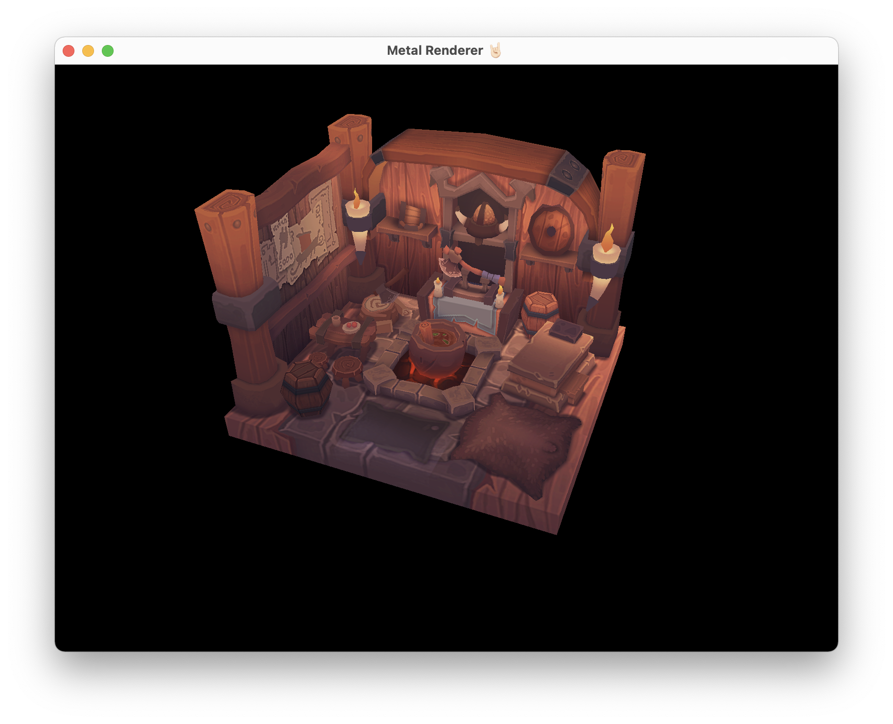

# SteelPhoenixEngine

A Metal toy engine written on Swift with the intention of learning Metal and implementing different rendering techniques.

## Current state

## Planned "stepping-stone" features
- [ ] Importing of .fbx and .obj files
- [ ] Blinn-Phong lighting model
- [ ] FPS camera
- [ ] Forward rendering
- [ ] Simple shadow maps

## Planned final features
- [ ] Simple GUI
- [ ] Physically-Based Rendering
- [ ] Sample Distribution Shadow Maps
- [ ] Deferred rendering
- [ ] Tile-Based Rendering / iOS version (?)
- [ ] ???